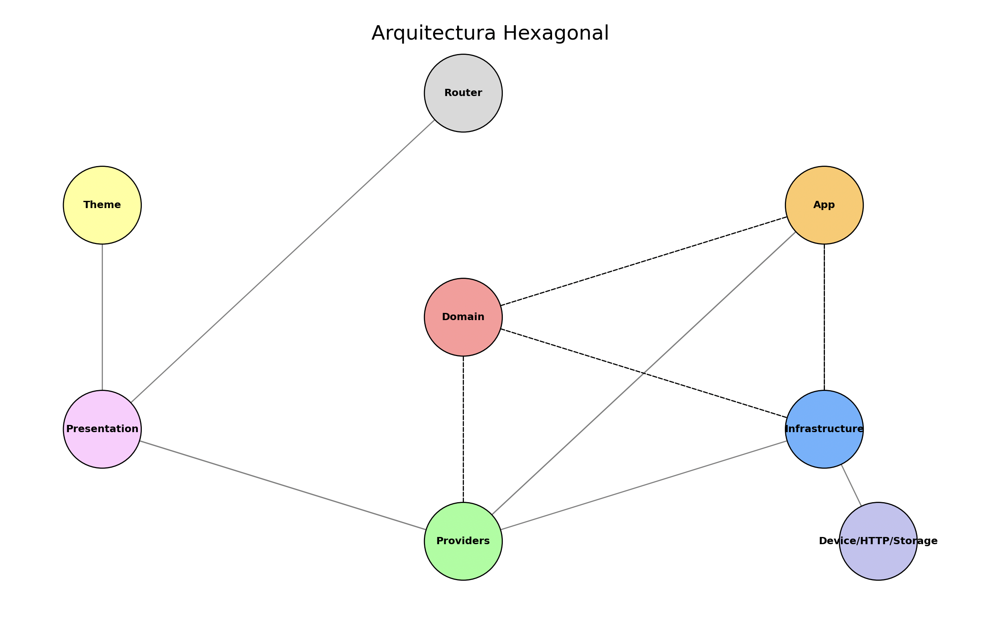

### README.md

 [](https://app.codacy.com/gh/psbarrales/boilerplate-react-app/dashboard?utm_source=gh&utm_medium=referral&utm_content=&utm_campaign=Badge_grade)   

 

# Webhook Watcher UI (MVP)

Interfaz para ver en vivo los webhooks capturados por la API. Genera y guarda un `webhookId` en `localStorage`/cookie, lista las solicitudes en una barra lateral y muestra el detalle al seleccionarlas.

Inicio rápido:

```bash
cd webapp
npm install
VITE_API_URL=http://localhost:3000 npm run dev
```

La app asume por defecto `http://localhost:3000` cuando se ejecuta en desarrollo (`:5173`). Ajusta `VITE_API_URL` si sirves la API en otra URL.

---

# Boilerplate App Template - v1.0.0

Bienvenido al proyecto base para el desarrollo de aplicaciones. Este sistema está construido con **Vite**, diseñado para ser modular, escalable y mantenible. Utiliza una **arquitectura hexagonal** (Ports and Adapters) que garantiza el desacoplamiento entre capas y facilita la evolución del sistema.

[](https://railway.com/template/3-YPmv?referralCode=__wSQ2)

## Tabla de Contenidos

1. [Descripción del Proyecto](#descripción-del-proyecto)
2. [Requisitos Previos](#requisitos-previos)
3. [Configuración del Entorno](#configuración-del-entorno)
4. [Estructura del Proyecto](#estructura-del-proyecto)
5. [Arquitectura del Proyecto](#arquitectura-del-proyecto)
6. [Desarrollo](#desarrollo)
   - [Pruebas](#pruebas)
   - [Storybook](#storybook)
7. [Integración de Componentes Shadcn](#integración-de-componentes-shadcn)
8. [Recursos Adicionales](#recursos-adicionales)
9. [Contribuir al Proyecto](#contribuir-al-proyecto)

---

## Descripción del Proyecto

**Nombre del Proyecto:** `boilerplate-app`

**Repositorio:** [https://github.com/psbarrales/boilerplate-react-app.git](https://github.com/psbarrales/boilerplate-react-app.git)

Este boilerplate está diseñado para construir aplicaciones modernas utilizando **React**, con **Vite** como empaquetador. Está optimizado para ofrecer:

- **Modularidad y escalabilidad** gracias a su **arquitectura hexagonal**.
- **Pruebas robustas** mediante **Testing Library** (unitarias) y **Cypress** con **Cucumber** (E2E).
- **Documentación visual de componentes** con **Storybook**.
- **Integración de componentes** [Shadcn](https://ui.shadcn.com/) para interfaces de usuario atractivas y accesibles.
- **Compatibilidad con Service Workers** para mejor rendimiento y accesibilidad.
- **Configuración de calidad de código** con **ESLint**.
- **Configuración de pruebas de calidad de código** con **Husky**.

> Esta versión del template está enfocada en lanzar rápidamente una plataforma o SaaS básico: incorpora autenticación con Firebase (login/registro), un panel privado con Dashboard, Opciones y Soporte, además de una landing page moderna lista para personalizar.

---

## Requisitos Previos

Para trabajar en este proyecto, necesitas tener instalados los siguientes programas:

- **Node.js**: versión 14 o superior.
- **npm** o **yarn**.
- **Git**.

---

## Configuración del Entorno

1. **Clona el repositorio**:

   ```bash
   git clone https://github.com/psbarrales/boilerplate-react-app.git
   cd boilerplate-react-app
   ```

2. **Instala las dependencias**:

   ```bash
   npm install
   # o
   yarn install
   ```

3. **Configura las variables de entorno** creando un archivo `.env.local` en la raíz del proyecto con tus credenciales de Firebase Authentication:

   ```bash
   VITE_FIREBASE_API_KEY="tu-api-key"
   VITE_FIREBASE_AUTH_DOMAIN="tu-dominio.firebaseapp.com"
   VITE_FIREBASE_PROJECT_ID="tu-project-id"
   VITE_FIREBASE_STORAGE_BUCKET="tu-storage-bucket"
   VITE_FIREBASE_MESSAGING_SENDER_ID="tu-sender-id"
   VITE_FIREBASE_APP_ID="tu-app-id"
   VITE_FIREBASE_MEASUREMENT_ID="tu-measurement-id"
   # Opcional: usa un ID de medición dedicado para Google Analytics
   VITE_GA_MEASUREMENT_ID="G-XXXXXXX"
   ```

   > Estos valores se obtienen desde la consola de Firebase en la sección **Configuración del proyecto → Tus apps**.

4. **Ejecuta el proyecto en modo desarrollo**:

   ```bash
   npm run dev
   # o
   yarn dev
   ```

5. **Accede a la aplicación** en tu navegador en `http://localhost:5173/`.

---

## Estructura del Proyecto

El proyecto sigue una estructura modular basada en **Arquitectura Hexagonal** (Ports and Adapters) y **Clean Architecture**. Aquí te presentamos una visión detallada de la estructura del proyecto:

1. **`src`**: Contiene los archivos de la aplicación.
  - **`application`**: Casos de uso de la aplicación.
    - **`auth`**: Manejo de autenticación con Firebase.
  - **`domain`**: Dominio de la aplicación, incluyendo modelos, puertos de entrada y salida.
  - **`infrastructure`**: Adaptadores para la infraestructura.
    - **`api`**: Adaptadores para consumir APIs.
     - **`capacitor`**: Adaptadores específicos para Capacitor.
     - **`firebase`**: Adaptadores específicos para Firebase.
   - **`assets`**: Archivos estáticos y recursos.
  - **`presentation`**: Componentes de Presentación.
    - **`pages/Auth`**: Vistas de autenticación (login, registro y layout).
    - **`pages/App`**: Dashboard, Opciones y Soporte para usuarios autenticados.
   - **`routes`**: Configuración de rutas.
   - **`theme`**: Estilos de la aplicación.
   - **`providers`**: Proveedores de contexto.
   - **`__test__`**: Archivos de pruebas.
2. **`cypress`**: Configuración para pruebas End-to-End con Cypress.
   - **`e2e`**: Archivos de pruebas Cucumber.
   - **`fixtures`**: Ficheros de datos para pruebas.
3. **`docs`**: Documentación del proyecto.
   - **`Template.md`**: Plantilla para documentación adicional.
   - **`Arquitectura.md`**: Descripción detallada de la arquitectura del proyecto.
   - **`Contribución.md`**: Guía de contribución al proyecto.
   - **`README.template.md`**: Plantilla para README.
   - **`repo.md`**: Información relevante del repositorio.
   - **`draw_diagram.py`**: Script para generar diagramas.
   - **`guide_generator.py`**: Generador de guías.
   - **`readme_generator.py`**: Generador de README.
   - **`repo_to_markdown.py`**: Convierte información del repositorio a Markdown.
   - **`architecture.png`**: Diagrama de arquitectura del proyecto.
4. **`stories`**: Componentes para Storybook.
   - **`.keep`**: Archivo para mantener la carpeta `stories` en el repositorio.
5. **`public`**: Elementos públicos de la aplicación.
6. **`dev-dist`**: Archivos generados para el desarrollo.
7. **`docs`**: Documentación y guías del proyecto.
8. **Archivos de configuración**:
   - **`babel.config.json`**: Configuración de Babel.
   - **`tsconfig.json`**: Configuración de TypeScript.
   - **`index.html`**: Archivo HTML principal.
   - **`vite.config.ts`**: Configuración de Vite.
   - **`cypress.config.ts`**: Configuración de Cypress.
   - **`.firebaserc`**: Configuración de Firebase.
   - **`.eslintrc.cjs`**: Configuración de ESLint.
   - **`.npmrc`**: Configuración de npm.
   - **`.editorconfig`**: Configuración de EditorConfig.
   - **`package.json`**: Archivo de dependencias y scripts del proyecto.
   - **`README.md`**: Documentación principal del proyecto.
   - **`.gitignore`**: Archivos y carpetas ignorados por Git.
   - **`package-lock.json`**: Archivo de dependencias lockeadas.
   - **`.nvmrc`**: Configuración de Node Version Manager.
   - **`commitlint.config.cjs`**: Configuración de CommitLint.
   - **`components.json`**: Configuración de componentes.
   - **`.browserslistrc`**: Configuración de soporte de navegadores.

---

## Arquitectura del Proyecto

El proyecto utiliza una **arquitectura hexagonal** que separa la lógica de negocio, la infraestructura y la interfaz de usuario. Esto facilita el mantenimiento, las pruebas y la implementación de nuevas funcionalidades. A continuación, describimos la estructura de las carpetas del proyecto:



Para una explicación completa de la estructura y las responsabilidades de cada carpeta, consulta [docs/Arquitectura.md](docs/Arquitectura.md).

---

## Desarrollo

### Pruebas

El proyecto incluye una amplia gama de pruebas para asegurar que la aplicación funcione correctamente y cumpla con los requisitos.

1. **Pruebas Unitarias**:

   - Enfócate en pruebas unitarias para componentes y Casos de Uso.
   - Herramienta: **Testing Library**.

   ```bash
   npm run test
   # o
   yarn test
   ```

2. **Pruebas End-to-End (E2E)**:

   - Utiliza **Cypress** con **Cucumber** para pruebas E2E.
   - Herramienta: **Cypress**.

   ```bash
   # Ejecutar pruebas E2E
   npm run test.e2e
   # o
   yarn test.e2e

   # Abrir Cypress para ejecutar pruebas E2E
   npm run test.e2e:open
   # o
   yarn test.e2e:open
   ```

### Storybook

Storybook proporciona una herramienta de visualización para componentes React, de modo que puedes desarrollar y probar tus componentes de forma aislada.

Para visualizar los componentes, ejecuta:

```bash
npm run storybook
# o
yarn storybook
```

El servidor de Storybook se ejecutará en `http://localhost:6006/`.

---

## Integración de Componentes Shadcn

Este proyecto incluye componentes pre-configurados de [Shadcn/ui](https://ui.shadcn.com/), una biblioteca de componentes atractivas y accesibles construidos con Radix UI y Tailwind CSS.

### Cómo añadir componentes Shadcn

1. **Instala un componente** usando el CLI de Shadcn:

   ```bash
   npx shadcn-ui@latest add button
   ```

2. **Usa el componente** en tu código:

   ```jsx
   import { Button } from '@/components/ui/button';

   export function MyComponent() {
     return <Button>Click me</Button>;
   }
   ```

3. **Personaliza los componentes** editando sus archivos en `src/components/ui/`.

Los componentes Shadcn son altamente personalizables y no tienen dependencias de runtime, lo que los hace ideales para este boilerplate. Consulta la [documentación oficial de Shadcn](https://ui.shadcn.com/docs) para más detalles.

---

## Configuración y Scripts

El archivo `package.json` contiene diversos scripts útiles para el desarrollo y despliegue del proyecto:

### Scripts

- **Desarrollo**: `npm run dev` ó `yarn dev`.
  - Ejecuta el servidor de desarrollo de Vite.
- **Construcción**: `npm run build` ó `yarn build`.
  - Construye la aplicación para producción.
- **Vista previa**: `npm run preview` ó `yarn preview`.

  - Vista previa de la aplicación en un entorno de producción.

- **Testing**:

  - Ejecutar pruebas unitarias: `npm run test` ó `yarn test`.
  - Ejecutar pruebas E2E: `npm run test.e2e` ó `yarn test.e2e`.
  - Abrir Cypress para ejecutar pruebas E2E: `npm run test.e2e:open` ó `yarn test.e2e:open`.

- **Linteo**:

  - Lintear código: `npm run lint` ó `yarn lint`.
  - Lintear y auto-corregir código: `npm run lint:fix` ó `yarn lint:fix`.

- **Storybook**:

  - Visualizar componentes: `npm run storybook` ó `yarn storybook`.
  - Construir Storybook para producción: `npm run build-storybook` ó `yarn build-storybook`.

- **Despliegue de Storybook**: `npm run chromatic` ó `yarn chromatic`.

- **Husky**:

  - Configura precommit usando Husky: `npm prepare` ó `yarn prepare`.

- **Chromatic**:
  - Para integración continua con Chromatic: `npm install @chromatic-com/storybook`.

## Contribuir al Proyecto

Contribuciones son bienvenidas. Sigue los pasos descritos en [docs/Contribución.md](docs/Contribución.md) para asegurarte de que tu contribución sea aceptada.

**Resumen de pasos para contribuir:**

1. Haz un fork del repositorio.
2. Crea una rama para tu funcionalidad o corrección.
3. Realiza tus cambios y asegura que las pruebas pasen.
4. Abre un Pull Request hacia la rama `main`.

---

## Recursos Adicionales

- **[Guía de Contribución](docs/Contribución.md)**: Detalles sobre cómo colaborar y mantener el código consistente.
- **[Arquitectura del Proyecto](docs/Arquitectura.md)**: Explicación detallada de la estructura y las responsabilidades de cada carpeta.
- **Storybook**: Ejecuta `npm run storybook` para ver los componentes disponibles.
- **Issues**: Reporta problemas, solicitudes de características y tareas pendientes en [Issues del Repositorio](https://github.com/psbarrales/boilerplate-react-app/issues).
- **Documentación de Tailwind CSS**: [Tailwind CSS](https://tailwindcss.com/docs).
- **Documentación de React Router**: [React Router](https://reactrouter.com/en/main).
- **Documentación de React**: [React](https://es.reactjs.org/docs/getting-started.html).
- **Documentación de Vite**: [Vite](https://vitejs.dev/).
- **Documentación de Cypress**: [Cypress](https://docs.cypress.io/).
- **Documentación de Storybook**: [Storybook](https://storybook.js.org/docs).
- **Documentación de Shadcn/ui**: [Shadcn/ui](https://ui.shadcn.com/docs).

---

## Contacto

- **GitHub**: [https://github.com/psbarrales/boilerplate-react-app](https://github.com/psbarrales/boilerplate-react-app)
- **Autor**: Psbarrales
